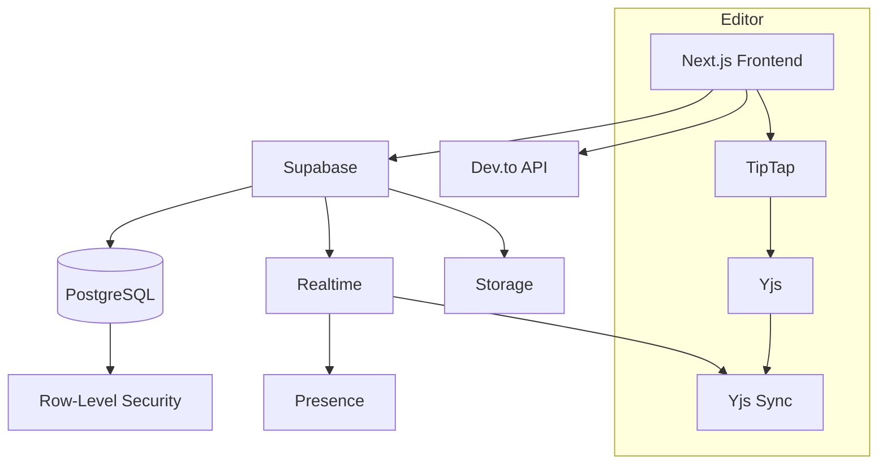
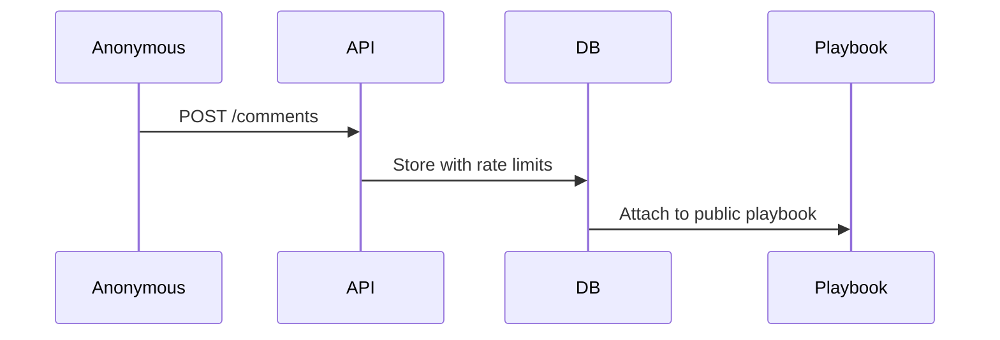

# CollabDeck - Collaborative Playbook Platform

## System Architecture

### Component Diagram



## Key Technologies

| Component | Technology |
|-----------|------------|
| Frontend | Next.js 15 (App Router), React 19 |
| Database | Supabase PostgreSQL |
| Realtime | Yjs + Supabase Realtime |
| Editor | TipTap with collaborative plugins |
| Auth | Supabase Magic Links |
| CMS | Dev.to API |

## Trade-Offs Made

### 1. Realtime Sync Implementation
- **Chose:** Yjs + Supabase Realtime
- **Alternative:** Socket.io custom server
- **Reason:** Faster implementation with built-in CRDT support, though less customizable

### 2. Authentication
- **Chose:** Email Magic Links
- **Alternative:** OAuth providers
- **Reason:** Lower barrier for user testing, though less social login convenience

### 3. Content Storage
- **Chose:** BYTEA for Yjs binary
- **Alternative:** JSON documents
- **Reason:** Better performance for collaborative editing, though harder to debug

## Future Work

### High Priority

#### 1. Public Comments System



#### 2. View Tracking
```sql
CREATE TABLE playbook_views (
  playbook_id UUID REFERENCES playbooks,
  viewer_id UUID NULL, -- Null for anonymous
  viewed_at TIMESTAMPTZ DEFAULT NOW()
);
```

#### 2. Markdown Support
- Implement TipTap Markdown extension
- Add dual-preview editor
- Support GitHub-flavored markdown

### Mid Priority
- Collaborative diagram editing
- Version history with diffs
- Mobile-optimized editor

### Nice-to-Have
- AI-powered content suggestions
- PDF/Word export
- Template gallery

## Development Setup

1. Clone repo
2. `npm install`  
3. Set up `.env` with Supabase credentials
4. Run database migrations:
   ```bash
   npx supabase db push
   ```
5. Start dev server:
   ```bash
   npm run dev
   ```


